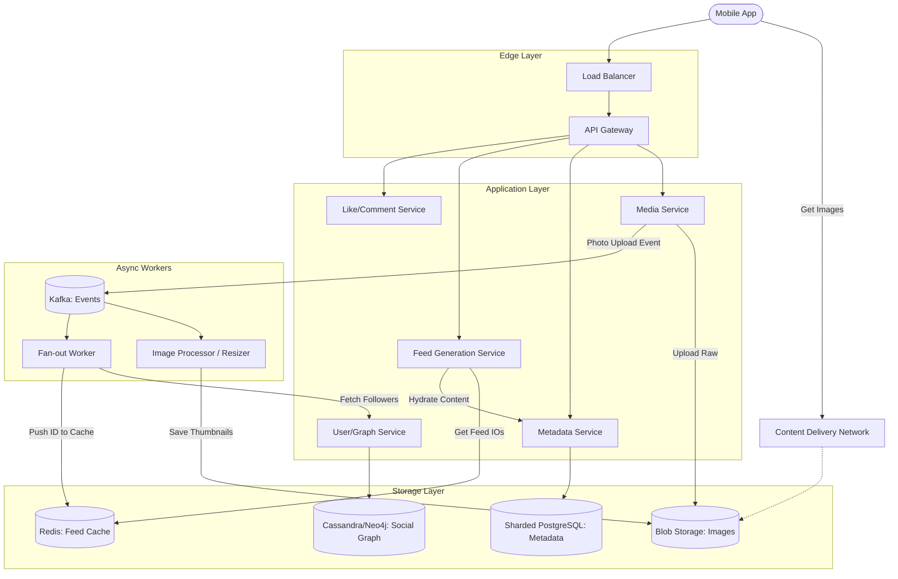

# High-Level Design: Instagram (Photo Sharing & Feed)

## 1. Requirements & Scope

### 1.1 Functional Requirements
*   **Post Media:** Users can upload photos/videos with captions and tags.
*   **Home Feed:** An aggregated, ranked stream of content from followed users.
*   **Follow Graph:** Unidirectional relationships (Follow/Unfollow).
*   **Social Interactions:** Likes and Comments.
*   **Search/Explore:** Discover content by hashtags or location.

### 1.2 Non-Functional Requirements
*   **Latency:** Feed load time < 200ms. Image upload < 1s (perceived).
*   **Availability:** 99.99% (Eventual consistency is acceptable for Feed).
*   **Durability:** 100%. User data (photos) must never be lost.
*   **Storage Efficiency:** The system must efficiently store petabytes of media.
*   **Scalability:** Support 500M+ DAU.

---

## 2. Capacity Estimation & Scale

### 2.1 Traffic Estimates
*   **DAU:** 500 Million.
*   **Photos Uploaded:** 500M DAU * 0.2 uploads/day = **100 Million photos/day**.
*   **QPS (Write):** 100M / 86400 ≈ **1,200 uploads/sec** (Peak: 3,000 QPS).
*   **QPS (Read - Feed):** 500M * 10 refreshes/day = 5B requests/day ≈ **58,000 req/sec** (Peak: 100k QPS).

### 2.2 Storage Estimates
*   **Average Photo Size:** 2 MB (Original) + 1 MB (Thumbnails/Variants) = 3 MB.
*   **Daily Storage:** 100M * 3 MB = **300 TB / day**.
*   **Yearly Storage:** 300 TB * 365 ≈ **110 PB / year**.
*   **Metadata Storage:** 1 KB per photo. 100M * 1KB = 100 GB/day.

---

## 3. High-Level Architecture

### 3.1 Logical Architecture Schema
1.  **Client:** Mobile app performing aggressive caching and optimistic UI updates.
2.  **Edge/Gateway:** Termination of SSL, DDoS protection, Rate Limiting.
3.  **Media Service:** Handles byte-stream upload, resizing, and CDN push.
4.  **Metadata Service:** Manages photo details (caption, location, user).
5.  **Feed Service:** The core complex component for generating timelines.
6.  **Social Graph Service:** Manages "Who follows Whom".

### 3.2 Mermaid Architecture Diagram


---

## 4. Data Model & Storage

### 4.1 Database Selection: PostgreSQL on shards
Instagram historically used **Sharded PostgreSQL** ensuring transactional integrity within a shard and simpler joins than NoSQL.
*   **Sharding Key:** `user_id`. All data for a user (photos, likes) lives on the same logical shard.
*   **ID Generation:** Custom epoch-based scalable IDs (like Snowflake) incorporated into a PL/PGSQL function.

### 4.2 Schema Design
```sql
-- Table: Users (Shard: user_id % 2048)
CREATE TABLE users (
    user_id BIGINT PRIMARY KEY,
    username VARCHAR(32),
    created_at TIMESTAMP
);

-- Table: Photos
CREATE TABLE photos (
    photo_id BIGINT PRIMARY KEY,
    user_id BIGINT,
    caption TEXT,
    s3_path VARCHAR(255),
    lat DOUBLE,
    long DOUBLE,
    created_at TIMESTAMP,
    INDEX(user_id, created_at) -- Optimizes "Get user's photos"
);

-- Table: Follows
CREATE TABLE follows (
    follower_id BIGINT,
    followee_id BIGINT,
    created_at TIMESTAMP,
    PRIMARY KEY (follower_id, followee_id)
);
```

---

## 5. Core Workflows

### 5.1 Image Upload (Write Path)
1.  **Upload:** User POSTs image binary to `Media Service`.
2.  **Storage:** Service writes to Blob Store (S3).
3.  **Metadata:** Service commits metadata (caption, location) to `DB_Meta` (Postgres).
4.  **Processing:** A message is sent to Kafka topic `photo-upload`.
5.  **Resizing:** Workers consume event, generate `large`, `medium`, `small` variants, and upload back to S3.
6.  **Fan-out:** Another worker group triggers the **Feed Update** flow.

### 5.2 Feed Generation (The "Hybrid" Approach)
*   **Pull Model (Fan-out on Read):** Bad for read latency.
*   **Push Model (Fan-out on Write):** Bad for celebrities (Justin Bieber problem).
*   **Solution: Hybrid**
    1.  **Normal Users:** When they post, standard **Push** (Fan-out on Write). Push the `photo_id` to all follower's underlying Redis lists.
    2.  **Celebrities:** Do not push.
    3.  **Feed Construction:** When a user requests their feed:
        *   Fetch the pre-computed feed from Redis (Normal users).
        *   Fetch recent posts from celebrities they follow (Pull).
        *   **Merge** the two lists in memory by timestamp.

---

## 6. Scalability & Performance

### 6.1 Caching Strategy
*   **Content (Images):** **CDN** is mandatory. Cache hit ratio should be > 98%.
*   **Feed:** **Redis**. Structure: `List<PhotoID>` (e.g., store only top 200 IDs).
*   **User Metadata:** Memcached/Redis Look-aside cache for User profiles.

### 6.2 Hotspot Mitigation
*   **Viral Photos:** If a photo gets 1M likes/sec, the `Likes` count becomes a write bottleneck.
*   **Solution:** **Sharded Counters**. Instead of 1 row having `count=1000`, split into 10 rows. `count = sum(row_1 + ... + row_10)`. Randomly pick a row to increment.

---

## 7. Consistency & Availability

*   **Photos:** **Strong Consistency** for the uploader (Reading your own write). **Eventual Consistency** for followers (Feed).
*   **Like Counts:** Eventual consistency. It's okay if a user sees "100 likes" and another sees "102".

---

## 8. Special Deep-Dive: Storage Optimization (The "Haystack" / "f4" Concept)

**Problem:** Filesystems perform poorly with billions of small files (inode limitations, many disk seeks). S3 is expensive for archival.

**Solution: Facebook's Haystack / f4 Architecture**
1.  **Logic:** Don't store billions of files. Concatenate them into massive 100GB files (Haystacks).
2.  **Metadata:** Keep an in-memory map of `(photo_id) -> (file_offset, length)`.
3.  **Operation:** To read a photo, seek to the offset in the massive file and read `length` bytes.
4.  **Optimization:** This reduces disk I/O operations from 3 (inode, dir, file) to 1 (seek+read).
5.  **Tiers:** Storage is moved to "Cold" storage (f4) after 3 months, which uses Erasure Coding (e.g., Reed-Solomon 10+4) to save 50% hard drive space compared to 3x Replication, while maintaining 10 nines durability.

---

## 9. Reliability & Fault Tolerance

*   **S3 redundancy:** S3 Standard provides Multi-AZ redundancy.
*   **Database:** Master-Slave replication for Postgres. If Master fails, promote Slave.
*   **Disaster Recovery:** Cross-region replication for S3 buckets (e.g., us-east-1 -> us-west-2).

---

## 10. Security & Abuse

*   **Image Moderation:** Async AI service (Amazon Rekognition or internal TensorFlow model) scans every uploaded image for NSFW/Violence.
*   **Signed URLs:** CDN URLs are signed with an expiration (e.g., 1 hour) to prevent hot-linking by other sites.

---

## 11. Monitoring

*   **Business Metrics:** Upload Success Rate, Feed Refresh Latency (p99).
*   **System Metrics:** Cache Hit Ratio, S3 Throughput, Kafka Lag.

---

## 12. Evolution

*   **Stories:** Ephemeral content requires a separate separate store (TTL-based storage like Cassandra with TimeWindowCompactionStrategy).
*   **Reels:** Video-first architecture requires Chunked Streaming (HLS/DASH) similar to the YouTube/Netflix design.
