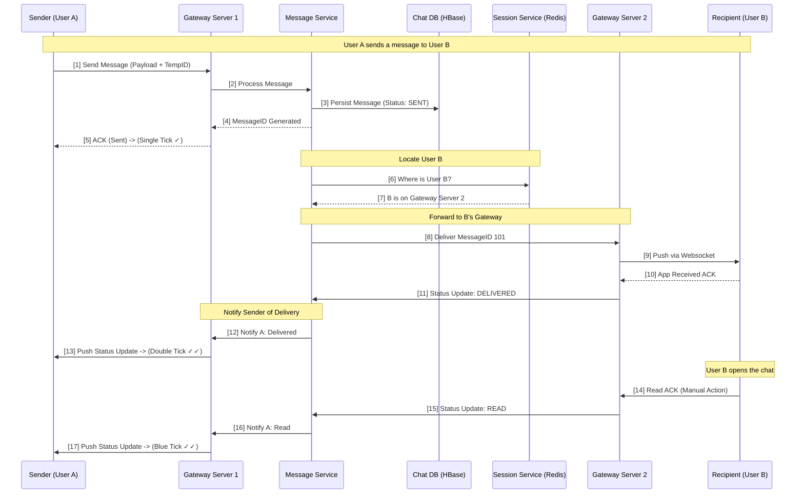
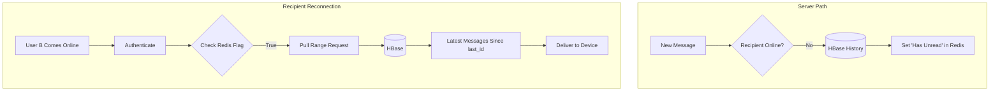
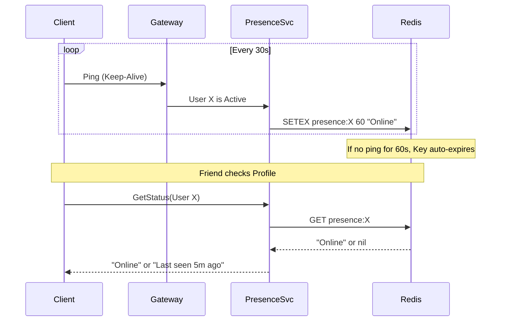

# System Design: Facebook Messenger / WhatsApp (Detailed)

*Designed by a Principal Engineer for High-Scale Distributed Systems Interviews.*

---

## 1. High-Level Architecture Visualization

Below is the conceptual architecture for a globally distributed chat system.

### Proper Architectural Overview
The system is built on a **Stateful Gateway Architecture**. Unlike standard stateless web apps, chat requires the server to "push" data to the client.

| Component | Responsibility |
| :--- | :--- |
| **Chat Gateway (Websockets)** | Maintains persistent TCP/Websocket connections. Per server, it can hold 50k-100k connections. |
| **Session Service** | A global Distributed Hash Table (Redis) mapping `UserID -> Gateway_IP`. |
| **Message Service** | Validates messages, generates IDs, and handles the "Tick" logic. |
| **Presence Service** | Tracks online/offline status via heartbeats. |
| **HBase / Cassandra** | Persistent storage for billions of messages, optimized for sequential range queries. |

---

## 2. Deep Dive: End-to-End Message Delivery Flow

This is the most critical part of the system. We ensure "At-least-once delivery" through a series of acknowledgments.

### Diagram: Message Flow & The "Ticks" Logic

### Explanation of the Ticks:
1.  **Single Tick (Sent)**: This means the message has reached the server cluster and is safely stored in the database. If User A's phone dies now, the message is still "Sent".
2.  **Double Tick (Delivered)**: This confirms that the recipient's device received the packet. If User B is in a tunnel, they won't get the double tick until they regain signal.
3.  **Blue Tick (Read)**: A specific application-layer event triggered when the UI renders the message in the foreground.

---

## 3. Handling Offline Messages & Synchronization

What happens when User B is offline? The "Push" fails, and we fall back to "Pull" upon reconnection.

### Diagram: Offline Sync Logic

### Explaining Sync vs. Push:
*   **Push (Real-time)**: High performance, low latency. Used when both parties are connected.
*   **Pull (Reconnection)**: High reliability. When the app starts, it asks: *"Give me everything after MessageID X"*. This ensures no messages are lost during network transitions.

---

## 4. Presence Service: Scalable Heartbeats

### Diagram: The Heartbeat Mechanism

---

## 5. Group Chat Fan-out

### Proper Handling of Large Groups:
1.  **Message Service** identifies the message is for a GroupID.
2.  Fetches Group Member List (Cached in Redis/Memcached).
3.  Iterates through 500 members.
4.  For **Online Members**: Push via their respective Gateways.
5.  For **Offline Members**: Do nothing (they will "Sync" on reconnect).

**Optimization**: We don't send 500 separate status updates for every "Double Tick" in a large group to the sender to prevent "ACK Storms". Instead, we aggregate them.

---

## 6. Storage Schema (Deep Dive)

We use a **Wide-Column Store (HBase/Cassandra)**.

### Key Choice: `chat_id` as Partition Key
*   **Why?**: Range queries are fast. When you scroll up in a chat, you are fetching a range of messages.
*   **Physical Storage**: By partitioning by `chat_id`, all messages between Alice and Bob are stored on the same physical machine and often the same block of disk. This makes "Scroll Up" operations involve **one disk seek** instead of thousands.

### Schema Table: `messages`
| Partition Key (`chat_id`) | Clustering Key (`message_id` DESC) | Attributes |
| :--- | :--- | :--- |
| `Alice_Bob_123` | `20251231_100501` | "Hello!" |
| `Alice_Bob_123` | `20251231_100500` | "Hi" |

---
*Created by Antigravity for Principal Engineer System Design Interviews.*
