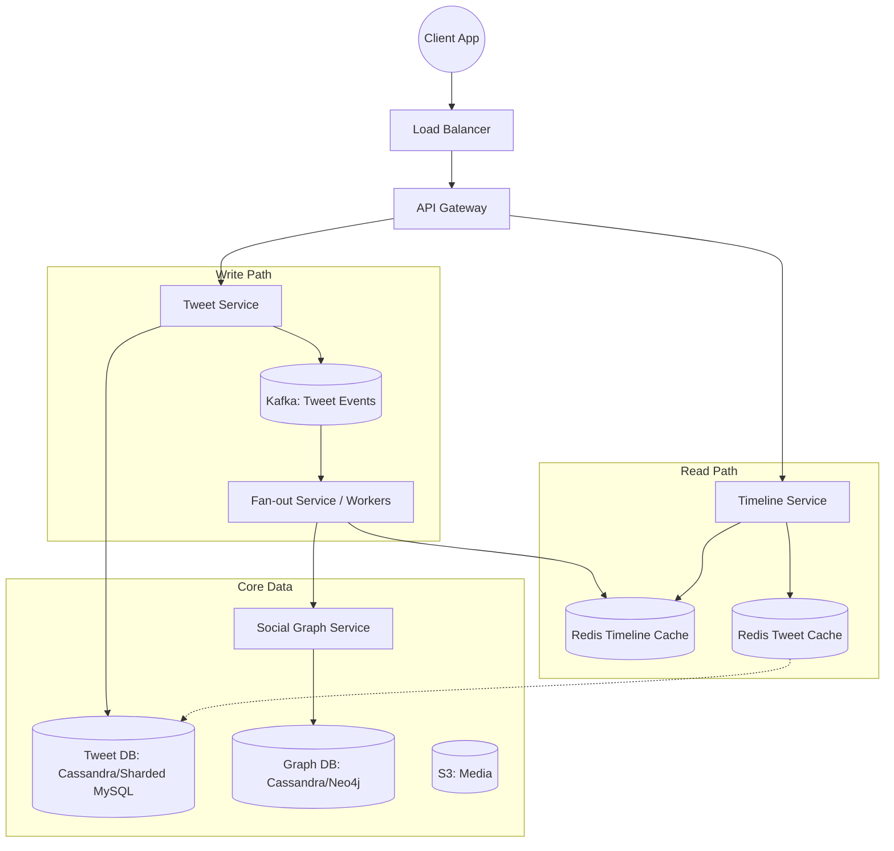

# System Design: Twitter (Timeline, Tweet, Follow)

*Designed by a Principal Engineer for High-Scale Distributed Systems Interviews.*

---

## 1. Requirements

### Functional Requirements
1.  **Post Tweet**: Users can post short text messages (up to 280 chars), optionally with media (images/videos).
2.  **Home Timeline**: Users can view an aggregated stream of tweets from people they follow, ordered by time (processing reverse-chronological first, algorithmic ranking later).
3.  **User Timeline**: Users can view their own past tweets.
4.  **Follow/Unfollow**: Users can follow other users to subscribe to their content.

### Non-Functional Requirements
1.  **Scalability**: Must handle **300M+ DAU** and spikes during global events (e.g., World Cup, Elections).
2.  **Latency**:
    *   **Read (Timeline)**: Ultra-low latency (**< 200ms** p99). This is the most critical metric.
    *   **Write (Tweet)**: Low latency (**< 500ms**).
3.  **Availability**: **99.99%**. The system should prioritize availability over strong consistency (Eventual Consistency is acceptable).
4.  **Consistency**: It is acceptable if a follower sees a tweet a few seconds after it is posted.
5.  **Durability**: Tweets must never be lost once acknowledged.

---

## 2. Capacity Estimation & Scale

### Assumptions
*   **DAU**: 300 Million.
*   **Tweets per User/Day**: ~2 (Average).
*   **Follows**: Average 200 follows/user. "Celebrity" users have 10M-100M followers.
*   **View vs. Write Ratio**: 100:1 (Heavy Read-intensive).

### Throughput (QPS)
*   **Writes (Tweets)**:
    *   $300M \times 2 = 600M$ tweets/day.
    *   Average QPS: $600M / 86400 \approx 7,000$ tweets/sec.
    *   Peak QPS (2x): **~14,000 tweets/sec**.
*   **Reads (Timeline)**:
    *   Assume each user visits their timeline 5 times/day.
    *   $300M \times 5 = 1.5B$ reads/day.
    *   Average QPS: $1.5B / 86400 \approx 17,000$ req/sec.
    *   **Pull vs Push impact**: In a "Push" model, internal write amplification triggers millions of internal requests.

### Storage
*   **Tweet Size**: Text (140 bytes) + Metadata (User ID, Timestamp, Location, etc.) $\approx$ 500 bytes.
*   **Daily Storage**: $600M \times 500 \text{ bytes} \approx 300 \text{ GB/day}$.
*   **Yearly Storage**: $300 \text{ GB} \times 365 \approx 100 \text{ TB/year}$.
*   **Media**: Stored in Object Storage (S3), typically PB scale.

### Bandwidth
*   Ingress (Text): $7k \times 500 \text{ bytes} \approx 3.5 \text{ MB/s}$ (trivial).
*   Egress (Timeline): $17k \times 20 \text{ tweets} \times 500 \text{ bytes} \approx 170 \text{ MB/s}$ (excluding media).

---

## 3. High-Level Architecture

### Component Responsibilities
1.  **Tweet Service**: Handles posting tweets, validating content, uploading media to S3, and persisting metadata to the Tweet DB.
2.  **Social Graph Service**: Manages follower/following relationships.
3.  **Timeline Service**: Aggregates and serves the home timeline.
4.  **Fan-out Service**: Background workers that push new tweet IDs into followers' timeline caches.
5.  **Redis (Timeline Cache)**: Stores the pre-computed list of Tweet IDs for active users.

---

## 4. Data Model & Storage

### Database Choice
1.  **Tweet Store**:
    *   **Choice**: **Cassandra** (or DynamoDB).
    *   **Why?**: High write throughput, wide-column structure fits "User ID -> List of Tweets", linear scalability.
    *   **Key Design**:
        *   `Partition Key`: `user_id` (Keeps a user's tweets together).
        *   `Clustering Key`: `timestamp` (Sorts tweets by time).
2.  **Social Graph**:
    *   **Choice**: **Cassandra** or **Sharded MySQL** (Vitess).
    *   **Why?**: Adjacency lists (User A -> Follows -> [B, C, D]).
    *   **Schema**:
        *   `Followers Table`: `(followee_id, follower_id)` (PK: `followee_id`).
        *   `Followings Table`: `(follower_id, followee_id)` (PK: `follower_id`).

### Global ID Generation (Snowflake)
We need a **64-bit unique ID** that is **k-sortable** (roughly time-ordered) to avoid using a separate Index for sorting `created_at`.
*   **Twitter Snowflake Algorithm**:
    *   1 bit: Sign.
    *   41 bits: Timestamp (Epoch).
    *   10 bits: Machine ID (Worker ID).
    *   12 bits: Sequence Number (Per millisecond).

---

## 5. Core Workflows

### A. Write Flow (Posting a Tweet)
1.  User sends `POST /tweets`.
2.  **Tweet Service** generates a unique ID (Snowflake).
3.  Saves tweet to **Tweet DB** (Cassandra).
4.  Publishes an event `TweetCreated(tweet_id, user_id)` to **Kafka**.
5.  Returns `201 OK` to user.
6.  (Async) **Fan-out Workers** consume from Kafka to update timelines.

### B. Read Flow (Viewing Timeline)
1.  User sends `GET /timeline`.
2.  **Timeline Service** checks **Redis** for the user's pre-computed timeline (List of Tweet IDs).
3.  If Cache Miss: Rebuild timeline (Pull model fallback).
4.  Service "hydrates" the Tweet IDs by fetching content from **Tweet Cache** (mapped by ID).
5.  Returns JSON to client.

---

## 6. Special Deep-Dive: Fan-out (Push vs. Pull)

The "Celebrity Problem" is the hardest challenge.

### 1. Push Model (Fan-out on Write)
*   **Mechanism**: When User A tweets, write the Tweet ID into the Redis List of *all* followers.
*   **Pros**: Read latency is $O(1)$. Very fast.
*   **Cons**: **Write Amplification**. If "Justin Bieber" (100M followers) tweets, the system must perform 100M writes to Redis instantly. This causes huge lag ("Tweet storm").

### 2. Pull Model (Fan-out on Read)
*   **Mechanism**: When User B reads their timeline, fetch all people they follow, get their latest tweets, and merge in memory.
*   **Pros**: No write amplification. Instant posting for celebrities.
*   **Cons**: **Read Latency**. If User B follows 2,000 people, the system must query 2,000 tweet queues and merge them. Scales poorly for read-heavy apps.

### 3. Final Decision: Hybrid Approach
We use a mixed strategy based on follower count.
*   **Normal Users (Small Graph)**: Use **Push Model**. When they tweet, push to all followers.
*   **Celebrities (Large Graph)**: Use **Pull Model**.
    *   Do not push their tweets to 10M lists.
    *   Store their tweets in a dedicated "Celebrity Store".
*   **Timeline Generation**:
    *   Fetch pre-computed timeline (from Normal users) from Redis.
    *   Async fetch updates from the specific Celebrities the user follows.
    *   **Merge** both lists in the application layer before returning.

**Trade-off**: Increases complexity in the Timeline Service but solves both Write Lag and Read Latency scaling issues.

---

## 7. Scalability & Performance

### Caching Strategy
1.  **Timeline Cache (Redis)**: Stores `List<TweetID>`.
    *   **Key**: `timeline:{user_id}`.
    *   **Capacity**: Keep only last 800 IDs per user.
    *   **TTL**: 2 weeks.
2.  **Tweet Cache (Memcached/Redis)**: Stores `Tweet Object`.
    *   **Key**: `tweet:{tweet_id}`.
    *   **Strategy**: Read-through. Hot tweets stay in memory.

### Async Processing
*   **Kafka** partitions by `user_id` to ensure ordering for a specific user's actions but allows parallel processing across partitions.

### Hot-Spot Mitigation
*   For a viral tweet being read by millions:
    *   **Local Caching**: Stores the tweet object in the application server instance memory (Guava cache) for seconds to reduce Redis hits.
    *   **Replica Reading**: Distribute reads across multiple Redis replicas.

---

## 8. Consistency & Availability

*   **CAP Theorem**: We choose **AP** (Availability + Partition Tolerance).
*   **Consistency Level**:
    *   Eventual consistency is fine for Timelines. It's okay if a follower sees a tweet 5 seconds late.
    *   **Cassandra**: use `Quorum` for writes if possible, or `One` for extreme speed with hinted handoff.
*   **Idempotency**:
    *   Clients send a `uuid` (dedup_id) with every tweet.
    *   Tweet Service checks if `dedup_id` was processed recently to prevent duplicates on retries.

---

## 9. Reliability & Fault Tolerance

*   **Circuit Breakers**: If the Social Graph Service is down, the Timeline Service degrades gracefully (shows cached timeline without new updates).
*   **Replication**: All DBs and Caches are replicated across at least 3 Availability Zones (AZs).
*   **Backpressure**: If Kafka queues fill up during a celebrity tweet storm, workers scale out or rate-limit processing, delaying delivery rather than crashing.

---

## 10. Security & Abuse Prevention

*   **Rate Limiting**: Token Bucket algorithm per user IP/ID. e.g., 100 posts/hour.
*   **Authentication**: OAuth2 / JWT.
*   **Data Privacy**: "Protected Tweets" require a check against the Social Graph (is `follower_id` approved?) before rendering content. This check happens at read time.

---

## 11. Monitoring & Observability

*   **Metrics (Prometheus/DataDog)**:
    *   `tweet_post_latency` (p95, p99).
    *   `timeline_refresh_latency`.
    *   `fanout_lag` (Time from "Tweet Created" to "Appears in Follower Cache").
*   **Tracing (OpenTelemetry)**: Trace the path of a single tweet from API -> DB -> Kafka -> Fanout -> Redis.
*   **Alerting**: Alert if `fanout_lag` > 5 seconds for 50% of users.

---

## 12. Evolution & Optimizations

*   **Ranking/Ads**: The simple reverse-chronological list is replaced by an **ML Ranking Service**. This service takes the candidate list (from Hybrid approach) and rescores/reorders based on relevance signals.
*   **Global Scale**: Deploy Timeline Services in multiple regions (US-East, EU-West, APAC). Use **Geo-DNS** to route users. Replicate the follower graph globally, but maybe keep Timeline Caches local to where the user usually logs in.
*   **Cost Optimization**: Move tweets older than 30 days to **cold storage (S3/Glacier)** and remove them from Cassandra.

---
*Created by Antigravity for SDE3/Staff Engineering System Design Interviews.*
