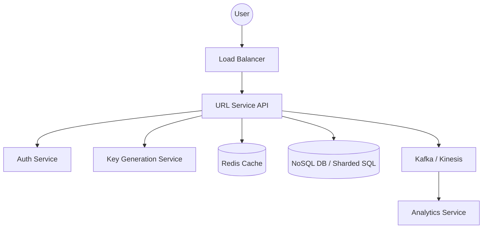

# System Design: Scalable URL Shortener (TinyURL)

This document provides a comprehensive high-level and low-level design for a URL shortening service similar to TinyURL or bit.ly, suitable for SDE3 level interviews.

---

## 1. Requirements

### Functional Requirements
1.  **Shortening**: Given a long URL, the service should generate a unique, shorter alias.
2.  **Redirection**: Clicking the short URL should redirect the user to the original long URL.
3.  **Custom Aliases**: Users should be able to specify a custom alias (optional).
4.  **Expiration**: URLs should expire after a default or user-defined time.
5.  **Analytics**: Track metrics like click counts, referrer, and user location.

### Non-Functional Requirements
1.  **High Availability**: The system must be 100% available (redirection is mission-critical).
2.  **Low Latency**: Performance should be near real-time (sub-100ms for redirection).
3.  **Scalability**: Handle billions of URLs and millions of requests per second.
4.  **Uniqueness**: No two long URLs should result in the same short URL (unless intended).

---

## 2. Back-of-the-Envelope Estimation

*   **Traffic**: Assume 100M new URLs shortened per month.
*   **Read/Write ratio**: Assume 10:1 (Redirection is much more frequent).
*   **Write QPS**: $100M / (30 \times 24 \times 3600) \approx 40$ writes/sec.
*   **Read QPS**: $400$ reads/sec (or much higher in peak traffic).
*   **Storage**: 500 bytes per record. $100M \times 500 = 50GB$ per month. For 5 years: $50GB \times 60 = 3TB$.
*   **Memory (Cache)**: Follow the 80-20 rule. 20% of read requests should be in cache. $400 \text{ reads/sec} \times 0.2 \times 3600 \times 24 \approx 7M$ URLs cached daily.

---

## 3. API Design

### POST /api/v1/shorten
**Request Body**:
```json
{
  "longUrl": "https://www.google.com/search?q=system+design",
  "customAlias": "sys-design", (optional)
  "expireAt": "2026-12-31T23:59:59Z" (optional)
}
```
**Response**: `201 Created` with `shortUrl`.

### GET /{shortKey}
**Response**: `302 Found` (Temporary Redirect) with `Location` header.
*Note: We use 302 instead of 301 (Permanent) to ensure analytics are captured for every click.*

---

## 4. Database Schema

A NoSQL database like **MongoDB** or **Cassandra** is preferred for its high scalability and schema flexibility, though a relational DB with sharding works too.

| Column | Type | Description |
| :--- | :--- | :--- |
| `id` | BigInt / String | Primary Key (Base62 encoded key) |
| `long_url` | String | Original URL |
| `user_id` | String | Owner of the link |
| `created_at` | DateTime | Timestamp |
| `expired_at` | DateTime | TTL |

**Indices**: Index on `id` (automatically handled by PK) and `user_id`.

---

## 5. High-Level Architecture Diagram



---

## 6. Detailed Design & Deep Dives

### A. The Encoding Algorithm (Base62)
To generate a 7-character string:
*   Using [a-z, A-Z, 0-9], we have 62 characters.
*   $62^7 \approx 3.5 \text{ Trillion}$ combinations. This is sufficient for decades.
*   **Implementation**: Convert a unique 64-bit integer (ID) to a Base62 string.

### B. High Scale ID Generation (No Collisions)
Generating unique IDs across multiple servers is hard.
1.  **Counter in DB**: Too slow, single point of failure.
2.  **Key Generation Service (KGS)**: A separate microservice that pre-generates IDs and stores them in an "unused" table. The API servers pull a block of IDs into memory to reduce DB overhead.
3.  **Snowflake/Ticket Server**: Use Twitter Snowflake logic to generate time-ordered unique IDs.

### C. Caching Strategy
*   Store mapping `shortKey -> longUrl` in **Redis**.
*   **Eviction Policy**: Least Recently Used (LRU) as we want to keep trending links "warm".

### D. Redirection Flow
1.  User visits `short.ly/xyz`.
2.  Load Balancer routes to API.
3.  API checks Redis for `xyz`.
4.  If **Cache Hit**: Return `302 Found` immediately.
5.  If **Cache Miss**: Query DB.
    *   If found: Update Redis and return `302`.
    *   If not found: Return `404 Not Found`.

---

## 7. Java Implementation (Core Logic)

```java
import java.util.concurrent.ConcurrentHashMap;

public class URLShortenerService {
    private static final String BASE62 = "0123456789abcdefghijklmnopqrstuvwxyzABCDEFGHIJKLMNOPQRSTUVWXYZ";
    
    /**
     * Converts a numeric ID (from KGS or Snowflake) to a Short Key.
     */
    public String encode(long id) {
        StringBuilder shortKey = new StringBuilder();
        while (id > 0) {
            shortKey.append(BASE62.charAt((int) (id % 62)));
            id /= 62;
        }
        return shortKey.reverse().toString();
    }

    /**
     * Example Redirection Logic in a Spring Controller
     */
    @GetMapping("/{shortKey}")
    public ResponseEntity<Void> redirect(@PathVariable String shortKey) {
        // 1. Check Redis Cache
        String longUrl = cacheService.get(shortKey);
        
        if (longUrl == null) {
            // 2. Check DB
            UrlMapping mapping = dbRepository.findByShortKey(shortKey);
            if (mapping != null) {
                longUrl = mapping.getLongUrl();
                cacheService.put(shortKey, longUrl);
            } else {
                return ResponseEntity.notFound().build();
            }
        }
        
        // 3. Fire-and-forget Analytics to Kafka
        kafkaTemplate.send("url-clicks", new ClickEvent(shortKey, Instant.now()));
        
        // 4. Redirect
        return ResponseEntity.status(HttpStatus.FOUND)
                .location(URI.create(longUrl))
                .build();
    }
}
```

---

## 8. Summary of Trade-offs
1.  **Relational vs NoSQL**: Relational is better for ACID properties of custom aliases; NoSQL is better for massive read/write scalability.
2.  **301 vs 302**: 301 is cached by the browser, reducing your server load but losing analytics. 302 ensures every click hits your server.
3.  **ID vs MD5 Hash**: Hashing the URL can lead to collisions (even with MD5/SHA). Base62 encoding a unique numeric ID is safer and more predictable.

---
*Created by Antigravity for SDE3 System Design Prep.*
