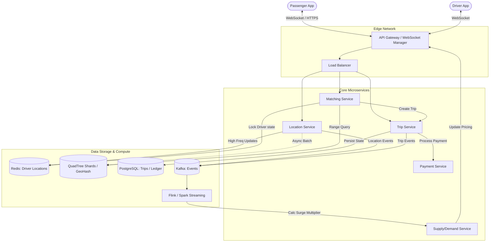

# High-Level Design: Uber/Lyft (Ride-Sharing Service)

## 1. Requirements & Scope

### 1.1 Functional Requirements
*   **Location Tracking:** Real-time updates of driver locations (every ~3-5 seconds).
*   **Ride Requesting:** Users can request a ride from a pickup point to a destination.
*   **Driver Matching:** Efficiently find the $N$ nearest available drivers and notify them.
*   **Dynamic Pricing:** Surge pricing based on real-time supply and demand.
*   **Ride Lifecycle:** Accept/Reject, Pickup, Start, End, and Payments.

### 1.2 Non-Functional Requirements
*   **Low Latency:** Driver matching and location updates must happen in near real-time (< 200ms).
*   **High Availability:** The system must be available 24/7; a ride in progress must not be lost.
*   **Scalability:** Support millions of concurrent drivers and users.
*   **Consistency:** Strong consistency for driver availability (a driver shouldn't be matched to two rides).
*   **Durability:** Transactional records (payments, ride history) must be durable.

---

## 2. Capacity Estimation & Scale

### 2.1 Traffic Estimates
*   **Active Drivers:** 1 Million.
*   **Active Riders:** 10 Million.
*   **Location Updates:** 1M drivers updates every 4 seconds = **250,000 Writes/Sec (Location Service)**.
*   **Ride Requests:** 100,000 requests/minute = **~1,600 QPS (Matching Service)**.

### 2.2 Storage Estimates
*   **Location Data:** We only need the *current* location for matching (In-memory/Redis). History can be archived to cold storage.
*   **Transaction Logs:** 1M rides/day * 2KB/record = **2GB/day**. 

---

## 3. High-Level Architecture

### 3.1 Logical Components
1.  **Passenger/Driver App:** Mobile clients communicating via WebSockets or gRPC for real-time updates.
2.  **Location Service:** High-throughput entry point for GPS coordinates.
3.  **Geospatial Index (QuadTree/GeoHash):** Stores driver locations for proximity queries.
4.  **Supply/Demand Service:** Tracks counts in specific areas for surge pricing.
5.  **Matching Service:** Orchestrates the driver discovery and notification logic.
6.  **Trip Service:** Manages the state machine of a ride (Status: `REQUESTED`, `ACCEPTED`, `ARRIVED`, `STARTED`, `COMPLETED`).

### 3.2 Architecture Diagram

---

## 4. Geospatial Indexing (The Core)

### 4.1 GeoHash (Static Sharding)
*   **Concept:** Divides the world into a grid of cells. Each cell has a base-32 string ID.
*   **Pros:** Easy to implement, SQL `LIKE` queries work for prefix matching.
*   **Cons:** "Boundary Problem"—drivers just across the line of a cell won't be found unless you search neighboring cells.

### 4.2 QuadTree (Dynamic Sharding - Preferred)
*   **Concept:** A tree where each node has exactly four children. A node is split into four when it contains more than $M$ drivers.
*   **Pros:** Automatically handles density. Cities (High density) have many small nodes; rural areas (Low density) have large nodes.
*   **Cons:** Rebuilding the tree frequently is expensive.
*   **Technical Implementation:** Keep the QuadTree **in-memory** across multiple shards. Use **Consistent Hashing** to route driver updates to the correct shard based on their `city_id`.

---

## 5. Core Workflows

### 5.1 Driver Location Update (Write Path)
1.  **Driver App** sends coordinates `(lat, long)` via WebSocket every 4 seconds.
2.  **Location Service** updates the **last_known_location** in Redis.
3.  **Geospatial Index** is updated.
    *   *Note:* Updating an in-memory QuadTree for 250k writes/sec is too much for a single machine.
    *   *Fix:* Shard the index by region/city.

### 5.2 Ride Request & Matching (Read Path)
1.  **User** requests a ride. **Matching Service** receives `(user_lat, user_long)`.
2.  **Query Index:** Find top $K$ drivers within a 3km radius.
3.  **Filter:** Filter out drivers who are `OCCUPIED` or have a low rating.
4.  **Notification:** Send request to the nearest driver via WebSocket.
5.  **Acceptance:** If Driver A rejects, move to Driver B. Use a **Distributed Lock** (Redis Redlock or Zookeeper) to ensure only one driver can "Accept" a specific `trip_id`.

---

## 6. Scalability & Performance

### 6.1 Handling Write Heavy Load
*   **Batching:** Buffer location updates on the client or gateway for 2 seconds and send them in a single batch.
*   **Redis Sharding:** Use Redis Clusters to handle 250k+ SET operations per second.

### 6.2 Hotspot Mitigation (The "Mall" Problem)
Areas like Airports or Malls have high density.
*   **Virtual Queues:** Instead of "searching" for drivers, put drivers at the airport in a FIFO queue.
*   **Dynamic QuadTree Splitting:** Scale the depth of the tree in these areas to maintain performance.

---

## 7. Consistency & Availability Trade-offs

*   **Rider/Driver Locations:** **Eventual Consistency** is acceptable. Being off by 5 meters or 2 seconds doesn't break the system.
*   **Driver Availability:** **Strong Consistency** is required. We use a **Transactional Database** (PostgreSQL) or a **Distributed Lock** to change a driver's state from `AVAILABLE` to `ON_TRIP`.

---

## 8. Special Deep-Dive: The Matching Algorithm

### 8.1 The "Naive" vs "Optimal" Approach
*   **Naive:** Find the closest driver by Euclidean distance.
*   **Problem:** Road distance != Euclidean distance. A driver might be across a river or on a one-way street.
*   **Advanced Solution:**
    1.  Get top 10 drivers via QuadTree (Euclidean).
    2.  Use a **Routing Engine (GraphHopper/OSRM)** to calculate the **ETA (Estimated Time of Arrival)** based on real-time traffic and road segments.
    3.  Rank drivers by ETA, not distance.

### 8.2 Handling "Herd Behavior"
If a request is sent to 10 drivers at once, all might click "Accept". 
*   **Solution:** Use a **Saga Pattern** or a centralized **Lock Manager**. First driver to acquire the lock for `trip_id` gets the ride; others get a "Ride already taken" message.

---

## 9. Dynamic Pricing (Surge)

*   **Input:** High frequency location updates and ride requests.
*   **Computation:** Use **Apache Flink** or **Spark Streaming** to calculate supply-demand ratios in GeoHash cells (e.g., Level 6 GeoHash).
*   **Output:** Update the `surge_multiplier` for that cell. The API Gateway applies this multiplier to the base fare.

---

## 10. Reliability & Fault Tolerance

*   **WebSocket Resiliency:** If a connection drops, the client should attempt an exponential backoff reconnect. The server should use a **Message Queue (Kafka)** to buffer notifications.
*   **Database Partitioning:** Partition Trip data by `trip_id` and archive completed trips to a Data Warehouse (BigQuery) for analytics.

---

## 11. Monitoring & Observability

*   **Precision/Recall of Matching:** How many requests resulted in a successful match?
*   **P99 Latency of Location Updates:** Are we lagging behind the driver's real position?
*   **Driver Churn:** Monitoring rejection rates to identify problems with the matching algorithm or pricing.

---

## 12. Future Evolutionary Steps

*   **Machine Learning for Dispatching:** Predict where demand will be in 30 minutes and nudge drivers to move there ahead of time.
*   **Pool/Shared Rides:** Solving the **Graph Matching** problem to combine two trips with minimal detour.
